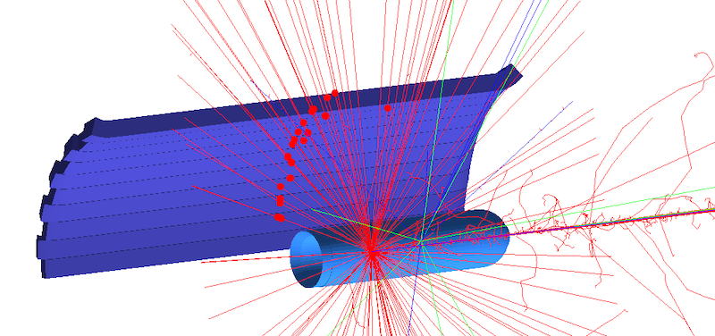
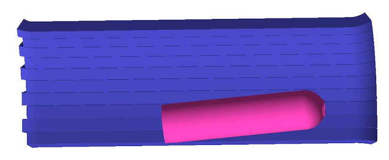

| [GEMC: Monte Carlo Particles and Hardware Simulator](https://gemc.github.io/home/) |
|:----------------------------------------------------------------------------------:|
|           Cad Imports: importing volumes and modifying their attributes            |


### Description

The geometry consists of a scattering chamber, a target container wall, and a set of scintillator bars.
All volumes come from STL files produced from a CAD model.

Two directories that contain STL files are imported:

- target_cad: a scattering chamber and the target container walls inside it
- tof_cad: 10 scintillator bars and a json file to assign properties such as sensitivity and material.

The custom material `my_scintillator` is created and assigned to the scintillator bars.




### Assigning CAD volumes properties

The json file `tof_cad/cad__default.json` assigns properties to the scintillator bars. 
The filename points to the 'default' variation, which is the default variation for the example.

The properties assigned in the json file are:

- color
- shift
- tilt
- flux sensitivity
- paddle identifier
- material

Similarly, properties are assigned to the scattering chamber and target walls. 


### Building the custom scintillator material
  
Execute cad_imports.py:

  ```
  ./cad_imports.py
  ```

This will create the `TEXT` database for the system. To use `SQLITE` instead, check the 
[sqlite database](../sqlite_db) example.


### Running gemc

Modify the jcard as needed (for example, set the desired number of events) and run:

```
gemc cad_imports.jcard -gui
```

Omit the '-gui' option to run in batch mode.


### Output

The output is defined by the entry `+goutput` in the jcard: two files are created simultaneously: 
`TEXT` and `ROOT` format. The files are identical in content and contain both true information 
and digitized output.

### CAD Variation `tilted`

For demonstration purposes, a variation that adds a 5 degrees rotation around the x-axis to the scattering chamber 
and target wall is included.

The json file `target_cad/cad__tilted.json` assigns the properties to the volumes
for the `tilted` variation. To use this variation, it must be specified in the jcard:

``` 
{ "system":   "./target_cad",  "factory": "CAD",  "variation": "tilted" }
```





### Notes
- the custom scintillator material is created in `materials.py`.
- the STL come from an engineering model where the z axis points upstream and a shift in z
  is relative to the center of the target. This is re-centered at (0,0,0) by the cad json files.
- running ` ./cad_imports.py` will not create the geometry, just the materials.


<br/><br/><br/>

---

### Author(s)

| M. Ungaro |   [](https://maureeungaro.github.io/home/)   |        [](mailto:ungaro@jlab.org)         | [](https://github.com/maureeungaro)  |
|:---------:|:------------------------------------------------------------------------------------------------------------------------:|:--------------------------------------------------------------------------------------------------------------------------------:|:----------------------------------------------------------------------------------------------------------------------------:|

