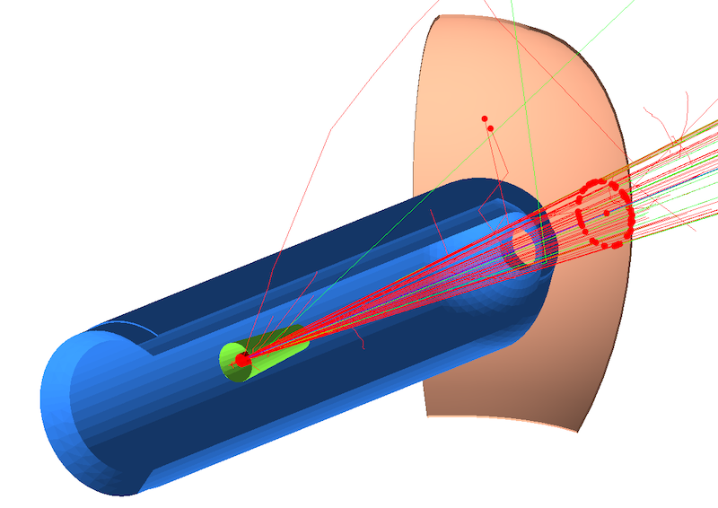

| [GEMC: Monte Carlo Particles and Hardware Simulator](https://gemc.github.io/home/) |
|:----------------------------------------------------------------------------------:|
|                             Dosimeter Digitization                                 |


### Description

 The setup consists of a target cell, two CAD imported volumes, and a silicon spherical wedge as the sensitive detector.

 The `dosimeter` sensitive type assigned to the wedge is a preloaded digitization plugin that will record
 radiation dose as particles pass through.




### Assigning cad volumes properties to the STL files

The scattering chamber and the target wall STL files in the `target_cad` directory.
The json file `target_cad/cad__default.json` assigns them properties.
The filename points to the `default` variation, which is the default variation for the example.

The properties assigned in the json file are:

- color
- shift
- tilt
- material


### Building target cell and dosimeter spherical wedge
  
Execute dosimeter.py:

```
./dosimeter.py
 ```

This will create the `TEXT` database for the system. To use `SQLITE` instead, check the 
[sqlite database](../sqlite_db) example.

### Running gemc

Modify the jcard as needed (for example, set the desired number of events) and run:

```
gemc dosimeter.jcard -gui
```

Omit the '-gui' option to run in batch mode.


### Output

The output is defined by the entry `+goutput` in the jcard: two files are created simultaneously: 
`TEXT` and `ROOT` format. The files are identical in content and contain both true information 
and digitized output.

The dosimeter digitization includes a `nielWeight` variable that is the radiation 
dose in units of NIEL (Non-Ionizing Energy Loss). 


### Notes

- the cell and dosimeter geometry is created using the dedicated `geometry.py` script.
- the STL come from an engineering model where the z axis points upstream and a shift in z
  is relative to the center of the target. This is re-centered at (0,0,0) by the cad json files.


<br/><br/><br/>

---

### Author(s)

| M. Ungaro |   [](https://maureeungaro.github.io/home/)   |        [](mailto:ungaro@jlab.org)         | [](https://github.com/maureeungaro)  |
|:---------:|:------------------------------------------------------------------------------------------------------------------------:|:--------------------------------------------------------------------------------------------------------------------------------:|:----------------------------------------------------------------------------------------------------------------------------:|

