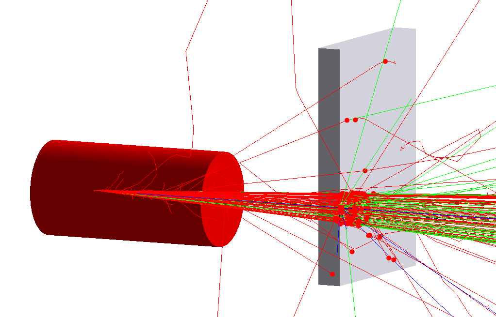

| [GEMC: Monte Carlo Particles and Hardware Simulator](https://gemc.github.io/home/) |
|:----------------------------------------------------------------------------------:|
|                                 Flux Digitization                                  |


### Description

 The setup consists of a target cell and a sensitive plastic scintillator.

 The `flux` sensitive type assigned to the scintillator is a preloaded digitization plugin 
 that will record a hit for each track passing through.




### Building the custom scintillator material
  
Execute flux_detector.py:

```
./flux_detector.py
 ```

This will create the `TEXT` database for the system. To use `SQLITE` instead, check the 
[sqlite database](../sqlite_db) example.

### Running gemc

Modify the jcard as needed (for example, set the desired number of events) and run:

```
gemc flux_detector.jcard -gui
```

Omit the '-gui' option to run in batch mode.


### Output

The output is defined by the entry `+goutput` in the jcard: two files are created simultaneously: 
`TEXT` and `ROOT` format. The files are identical in content and contain both true information 
and digitized output.

The flux digitization includes relevant variables such as:

- `hitn` : hit number
- `pid` : particle id
- `paddleid` : sciintillator identifer set in the geometry
- `time` : time of the hit
- `totalE` : track total energy
- `totEdep` : total energy deposited


### Notes

- the cell and scintillator geometry is created using the dedicated `geometry.py` script.


<br/><br/><br/>

---

### Author(s)

| M. Ungaro |   [](https://maureeungaro.github.io/home/)   |        [](mailto:ungaro@jlab.org)         | [](https://github.com/maureeungaro)  |
|:---------:|:------------------------------------------------------------------------------------------------------------------------:|:--------------------------------------------------------------------------------------------------------------------------------:|:----------------------------------------------------------------------------------------------------------------------------:|

