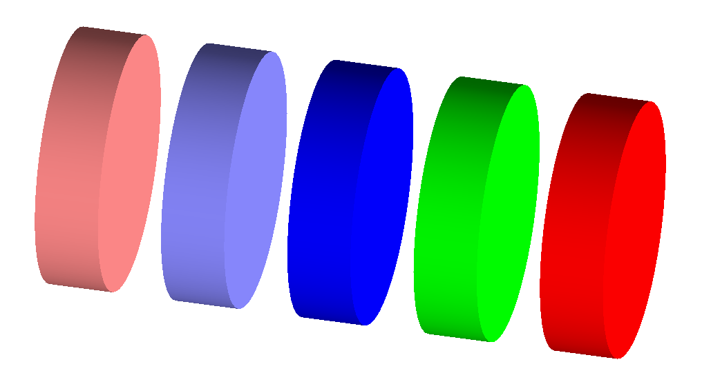

| [GEMC: Monte Carlo Particles and Hardware Simulator](https://gemc.github.io/home/) |
|:----------------------------------------------------------------------------------:|
|                        Different ways to create materials                          |


### Description

 The setup consists of 5 target cell (G4Tubs) with different materials:

- liquid hydrogen from the [Geant4 Materials Database](https://geant4-userdoc.web.cern.ch/UsersGuides/ForApplicationDeveloper/html/Appendix/materialNames.html) 
(G4_lH2)
- a `peek` material created using fractional masses of Geant4 materials from the Geant4 Materials Database
- an `epoxy` material created using number of atoms of Geant4 elements
- a `carbon fiber` material created using fractional masses of the `epoxy` material and the `carbon` 
  material from the geant4 database
- a `resistive strips paste` that redefine the density of an existing material

See the file `materials.py` for details.




### Building the custom scintillator material
  
Execute basic_materials.py:

```
./basic_materials.py
 ```

This will create the `TEXT` database for the system. To use `SQLITE` instead, check the 
[sqlite database](../sqlite_db) example.

### Running gemc

Modify the jcard as needed (for example, set the desired number of events) and run:

```
gemc basic_materials.jcard -gui
```

Omit the '-gui' option to run in batch mode.


<br/><br/><br/>

---

### Author(s)

| M. Ungaro |   [](https://maureeungaro.github.io/home/)   |        [](mailto:ungaro@jlab.org)         | [](https://github.com/maureeungaro)  |
|:---------:|:------------------------------------------------------------------------------------------------------------------------:|:--------------------------------------------------------------------------------------------------------------------------------:|:----------------------------------------------------------------------------------------------------------------------------:|

