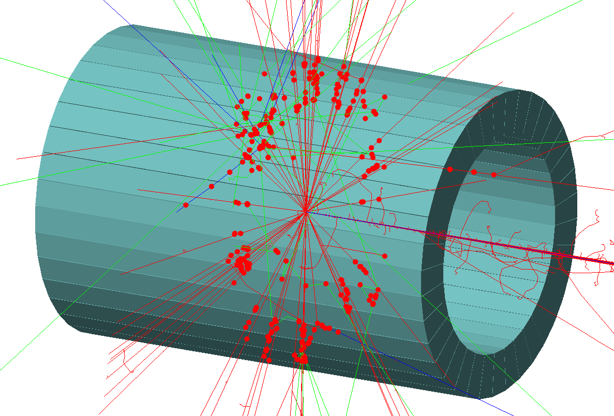

| [GEMC: Monte Carlo Particles and Hardware Simulator](https://gemc.github.io/home/) |
|:----------------------------------------------------------------------------------:|
|                                 Scintillator Array                                 |


### Description

 The setup consists of a scintillator array built using the `make_trapezoid` method.




### Building the array
  
Execute scintillator_array.py:

```
./scintillator_array.py
 ```

This will create the `TEXT` database for the system. To use `SQLITE` instead, check the 
[sqlite database](../sqlite_db) example.


### Running gemc

Modify the jcard as needed (for example, set the desired number of events) and run:

```
gemc scintillator_array.jcard -gui
```

Omit the '-gui' option to run in batch mode.


### Output

The output is defined by the entry `+goutput` in the jcard: two files are created simultaneously: 
`TEXT` and `ROOT` format.


### Notes

- the geometry and materials are created in the dedicated `geometry.py` and `materials.py` scripts.


<br/><br/><br/>

---

### Author(s)

| M. Ungaro |   [](https://maureeungaro.github.io/home/)   |        [](mailto:ungaro@jlab.org)         | [](https://github.com/maureeungaro)  |
|:---------:|:------------------------------------------------------------------------------------------------------------------------:|:--------------------------------------------------------------------------------------------------------------------------------:|:----------------------------------------------------------------------------------------------------------------------------:|

