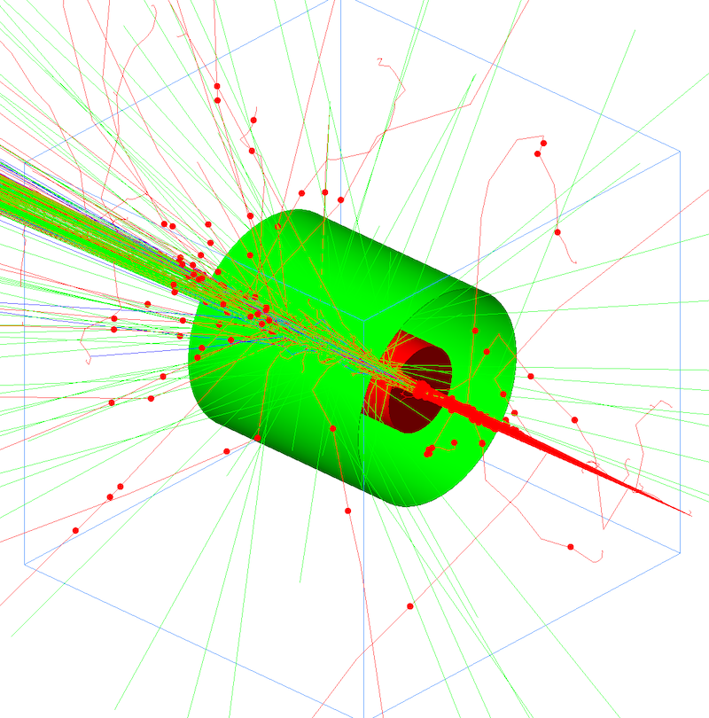

| [GEMC: Monte Carlo Particles and Hardware Simulator](https://gemc.github.io/home/) |
|:----------------------------------------------------------------------------------:|
|                 SQLITE: geometry and materials to an sql database                  |


### Description

A geometry consisting of a water vapor cloud chamber with a target and a lead shield is built 
within an `SQLITE` database. For comparison, the `TEXT` format is also used.

gemc reads the sqlite geometry and material definitions to build the Geant4 world.




### Building geometry and materials
  
Execute sqlite_db.py.py:

  ```
  ./sqlite_db.py
  ```

### Running gemc

Modify the jcard as needed (for example, set the desired number of events) and run:

```
gemc sqlite_db.jcard -gui
```

Omit the '-gui' option to run in batch mode.


### Output

The output is defined by the entry `+goutput` in the jcard: two files are created simultaneously: 
`TEXT` and `ROOT` format.

The root file contains ntuples with true information and digitized output.

### Notes

- Both TEXT and SQLITE databases are created when running `sqlite_db.py`. 
  The database source for gemc can be selected in the jcard by setting the `factory` entry to either:
  - `TEXT`
  - `SQLITE`


---

### Author(s)

| M. Ungaro |   [](https://maureeungaro.github.io/home/)   |        [](mailto:ungaro@jlab.org)         | [](https://github.com/maureeungaro)  | [](https://gemc.github.io/home/) |
|:---------:|:------------------------------------------------------------------------------------------------------------------------:|:--------------------------------------------------------------------------------------------------------------------------------:|:----------------------------------------------------------------------------------------------------------------------------:|:-----------------------------------------------------------------------------------------------------------------------:|


